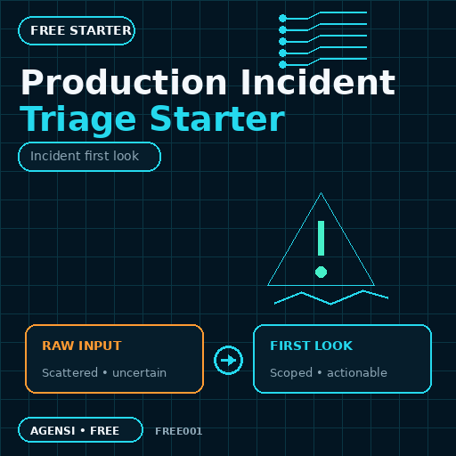

# Production Incident Triage Starter

Turn rough production incident material into a scoped first-look brief with observed facts, unknowns, impact signals, timeline anchors, safe next checks, and a clean specialist handoff.

## Safety and scope

- Read-only.
- Uses only material you provide.
- No shell, network, production access, file changes, or automatic remediation.
- Does not declare a root cause or replace a full investigation.

## Install

Copy `SKILL.md` into the skills directory used by your SKILL.md-compatible agent.

More skills: [Agensi creator profile](https://www.agensi.io/creators/mariusz-wrzeszczynski)

Linux/NVIDIA utilities: [ToolForge Labs](https://pudi21.gumroad.com)

## License

See [LICENSE.md](LICENSE.md).
